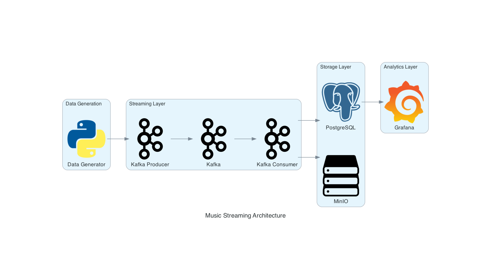
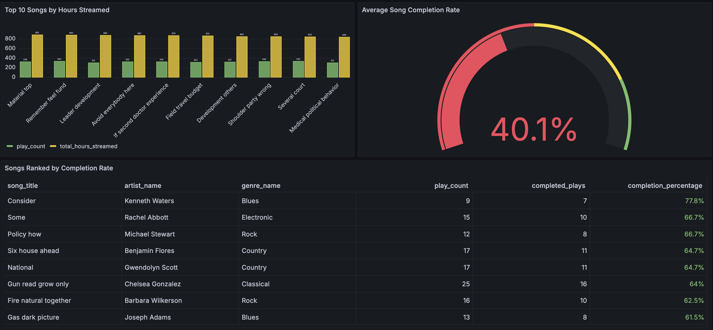
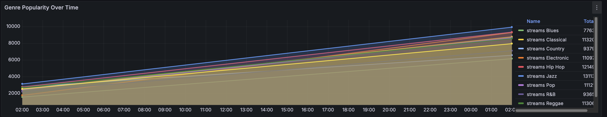
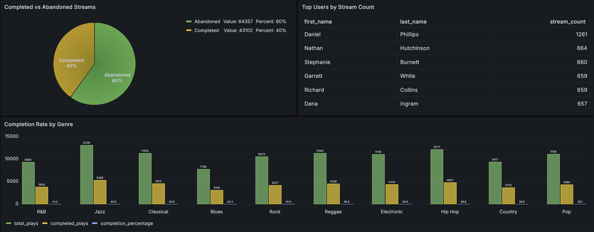
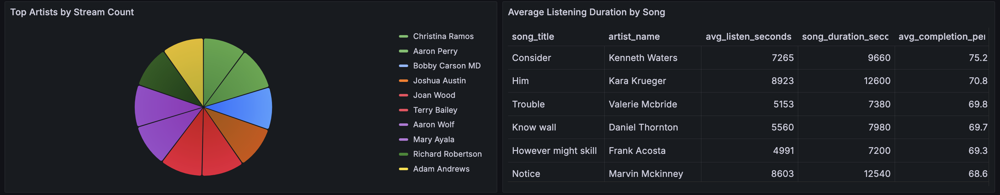
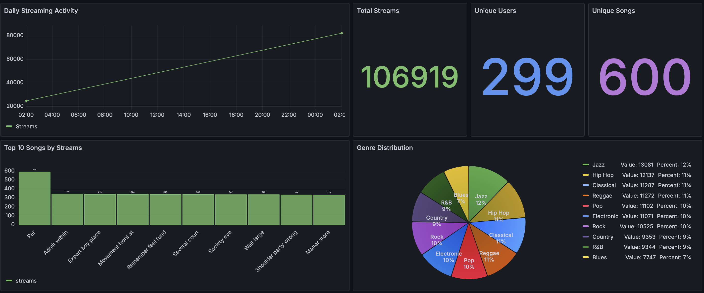

# Music Streaming Data Pipeline

[](https://github.com/keyr-code/music-streaming/actions/workflows/unit-tests.yml)
[](https://github.com/keyr-code/music-streaming/actions/workflows/integration-tests.yml)

A real-time data pipeline for a music streaming platform built with Kafka, MinIO, and PostgreSQL.

## Overview

This project simulates a complete data pipeline for a music streaming service:
- Generates realistic user listening events
- Streams data in real-time using Kafka
- Stores raw data in MinIO (S3-compatible storage)
- Processes structured data in PostgreSQL
- Provides analytics dashboards with Grafana

## Architecture



## Features

- **Real-time data streaming** with Kafka
- **Object storage** with MinIO
- **Relational database** with PostgreSQL
- **Comprehensive logging** across all components
- **Containerized environment** with Docker Compose
- **Analytics dashboards** with Grafana

## Project Structure

```
music_streaming/
├── config/                  # Configuration files
├── data_generators/         # Data generation modules
├── kafka_stream/            # Kafka producers and consumers
├── logger/                  # Logging utilities
├── setup/                   # Setup and initialization scripts
├── tests/                   # Test suite
└── docker/                  # Docker configuration files
```

## Prerequisites

- Python 3.7+
- Docker and Docker Compose

## Quick Start

1. **Clone the repository**
   ```bash
   git clone https://github.com/yourusername/music-streaming.git
   cd music-streaming
   ```

2. **Install dependencies**
   ```bash
   pip install -r requirements.txt
   pip install -e .
   ```

3. **Start services**
   ```bash
   cd music_streaming/docker
   docker-compose up -d
   ```

4. **Initialize infrastructure**
   ```bash
   python -m music_streaming.setup.init_minio
   python -m music_streaming.setup.init_postgres
   ```

5. **Start the data pipeline**
   ```bash
   # Terminal 1: Start the producer
   python -m music_streaming.kafka_stream.kafka_producer_streaming
   
   # Terminal 2: Start the consumer
   python -m music_streaming.kafka_stream.kafka_consumer
   ```

## Service Access

- **Kafka Control Center**: http://localhost:9021
- **MinIO Console**: http://localhost:9001
- **pgAdmin**: http://localhost:8080
- **Grafana**: http://localhost:3000

## Grafana Dashboards

The project supports Grafana dashboards for music streaming analytics. You can create dashboards for:

1. **Music Streaming Overview**
   - Overall platform metrics
   - Daily streaming activity
   - Top songs and genre distribution

   

2. **User Engagement**
   - Completed vs abandoned streams
   - Top users by stream count
   - Completion rate by genre

   

3. **Content Performance**
   - Top songs by hours streamed
   - Average song completion rate
   - Genre popularity over time

   

### Dashboard Examples





### Creating Dashboards

1. Access Grafana at http://localhost:3000
2. Navigate to Dashboards > New Dashboard
3. Create panels using PostgreSQL as the data source
4. Save your dashboard configurations

## Configuration

All configuration settings are stored in the `music_streaming/config/` directory:
- `kafka_config.py`: Kafka broker and topic settings
- `minio_config.py`: MinIO endpoint, credentials, and bucket settings
- `postgres_config.py`: PostgreSQL connection settings

## Logging

The application uses a centralized logging system that records application events with timestamps.

## Testing

The project includes a comprehensive test suite with both unit and integration tests.

### Running Tests

```bash
# Run all tests
make test

# Run only unit tests
make test-unit

# Run only integration tests
make test-integration

# Run tests with coverage report
make test-coverage
```

You can also run tests using pytest directly:

```bash
# Run all tests
pytest

# Run with verbose output
pytest -v

# Run specific test file
pytest music_streaming/tests/unit/test_data_generator.py
```

### Test Structure

- `music_streaming/tests/unit/`: Unit tests that don't require external services
- `music_streaming/tests/integration/`: Integration tests that require running services

## License

MIT
